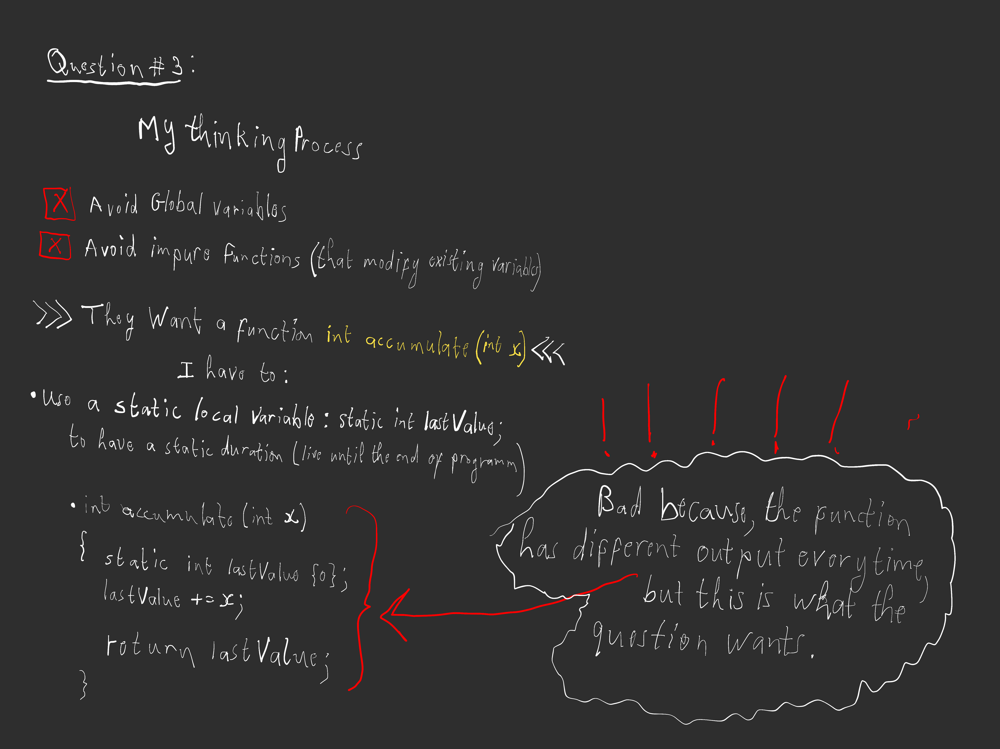

# Question #3

Write a function int accumulate(int x). This function should return the sum of all of the values of x that have been passed to this function.


The following program should run and produce the output noted in comments:

```c++

#include <iostream>

int main()
{
    std::cout << accumulate(4) << '\n'; // prints 4
    std::cout << accumulate(3) << '\n'; // prints 7
    std::cout << accumulate(2) << '\n'; // prints 9
    std::cout << accumulate(1) << '\n'; // prints 10

    return 0;
}
```  
<br>

## My whiteboarding / paper prototyping
